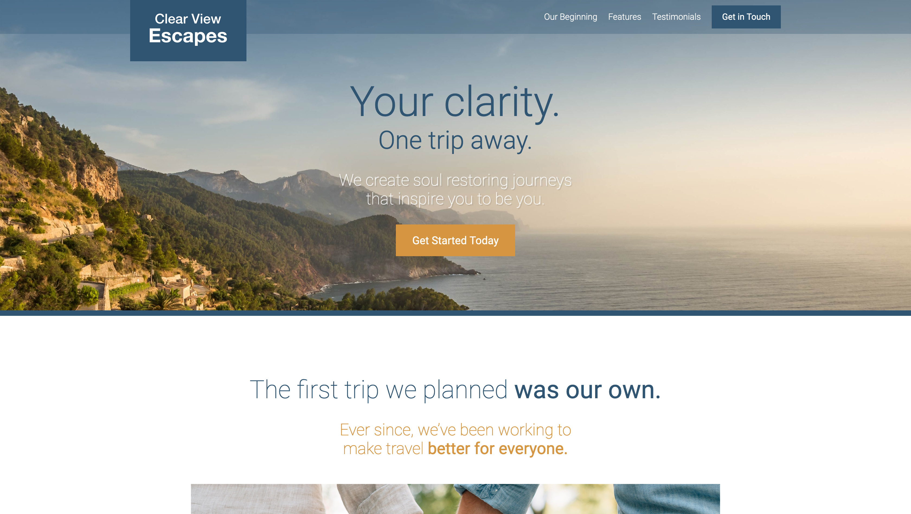

# Travel Site

As I learn more about the industry standards in web development tools, practices and work flow, I wanted to have a project where I can try to put everything together and make them work. 

Therefore, we have this fictional travel website where the users can book their vacation through an application. This is a single-page website for advertising the application.

For the Secret Client Area at the bottom of the page, this is where I implemented a simple example with AWS Lambda Cloud function to send requests and working with the responses received. The secret passphrase is *'javascript'*.

## Live Demo

The application is hosted with **Netlify** and you can have a look at the website [here](https://sad-jones-cae779.netlify.app/).

## What I have learned from this project

- Modern workflow with automation and files organization
- Webpack Configuration for development and production
- Modular CSS Implementation
- BEM Methodology (Block Element Modifier)
- Mobile-first and Responsive Images web design (with focus on screen size, DPI, resolution and orientation)
- Implemented CSS animations, row and flexbox without using any CSS framework such as Bootstrap
- AWS Lambda Cloud Function
- Throttling and deboucing to save browser processing power
- Lazy loading

## Tools and Main Packages I used for this project

- Node.js
- Webpack
- PostCSS
- Normalize.css
- Babel 
- Lodash (for throttling and deboucing)
- Lazysizes (for images lazy loading)
- Axios (for triggering AWS Lambda cloud function)
- Git
- Netlify
